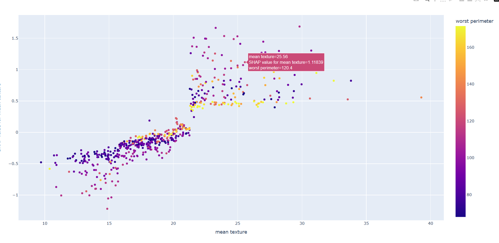
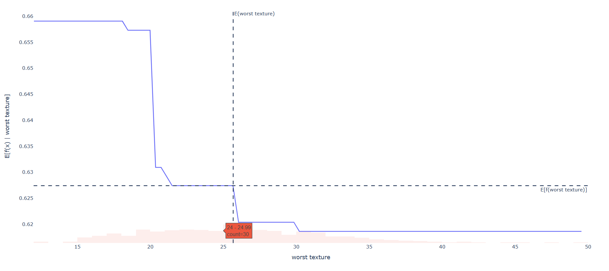
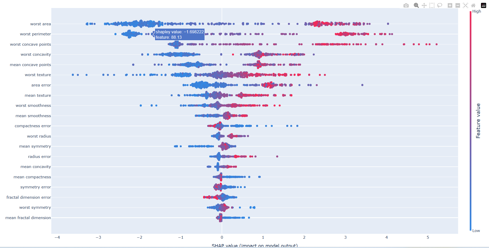

# shap-interactive-plots

[SHAP](https://shap.readthedocs.io/en/latest/) is a useful model interpretation tool that provides a variety of visualization methods. However, most of the plots in SHAP are drawn with `matplotlib`, which is neither interactive nor easy to modify.

This project reimplements these images with [Poltly](https://github.com/plotly/plotly.py), in which way model interpretation diagrams can be embedded in web pages as interactive, customizable components.

### Features

- [x] waterfall
- [x] local dependence
- [x] summary (beeswarm)
- [x] decision
- [x] dependence (scatter)

> Not all drawing details have been implemented

### Testing

```bash
pip install -r requirements_dev.txt
pytest test/testall.py
```







